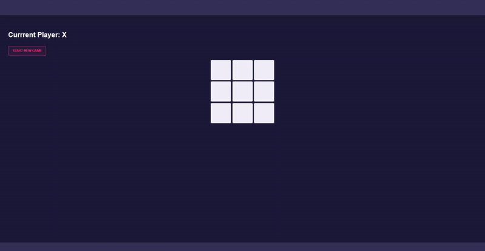
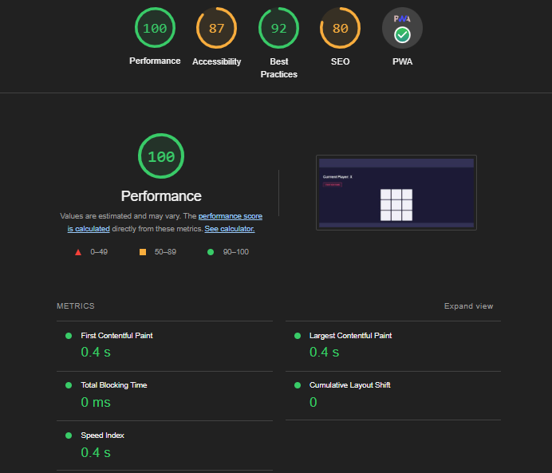
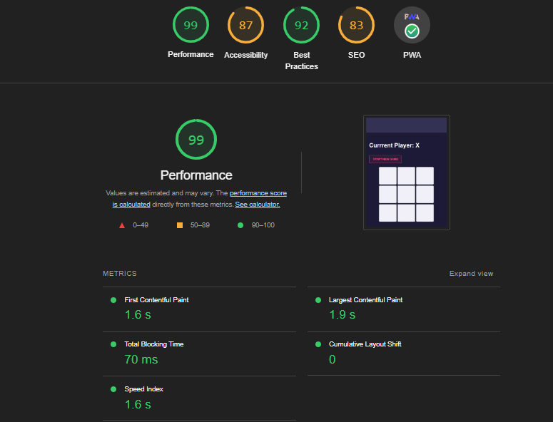
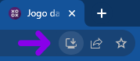

# TicTacToe (Jogo da Velha) em Angular
 

Este projeto foi desenvolvido como uma implementação do jogo da velha utilizando Angular, inspirado no tutorial:

 

O projeto original pode ser encontrado:

### Aplicação

## 🌟 Destaques

- **Progressive Web App (PWA)**: o jogo pode ser instalado e rodado offline em dispositivos compatíveis.
- **Responsividade**: O design foi aprimorado para oferecer uma experiência otimizada para dispositivos móveis.
- **Atualizações e Melhorias** em relação ao projeto original:
  - Prevenção de novos movimentos após determinar um vencedor.
  - Ocultação da mensagem indicando o jogador atual quando há um vencedor.
  - Otimização no foco de itens clicados.
  - Melhor compatibilidade com o kit UI do Nebular (foi necessário utilizar uma versão anterior do Angular para garantir essa compatibilidade).

### Lighthouse Report (Desktop)

### Lighthouse Report (Mobile)

### Instalação PWA pelo Google Chrome

## Buscando Contribuições

Estou ativamente buscando contribuições em áreas específicas para aprimorar este projeto. Se você está interessado em ajudar, aqui estão algumas das próximas features e melhorias que estou considerando:

### 1. Jogo Contra o Computador
Desenvolver um algoritmo onde o usuário possa jogar contra o computador em diferentes níveis de dificuldade:
- **Fácil**: O computador faz jogadas aleatórias.
- **Médio**: O computador joga como no nível "Impossível", porém com 50% de chance de fazer uma jogada aleatória a cada turno. 
- **Impossível**: O computador joga de maneira otimizada, onde nunca perderá. O máximo que o usuário pode conseguir é um empate.

> Este método ainda poderá ser polido e implementado algo melhor **(principalmente para a dificuldade média)**.

### 2. Integração com Nebular UI Kit para Testes
- Estou buscando alguém que tenha experiência ou conhecimento sobre como importar módulos do Nebular UI Kit para serem usados em testes com o Karma. Se você tem experiência nessa área ou sabe como fazer isso, sua ajuda seria muito valiosa!

**Se você pode contribuir em qualquer uma dessas áreas, ou tem outras ideias para melhorar o projeto, por favor, considere fazer um fork e enviar um Pull Request ou abrir uma Issue para discutirmos suas ideias!**

## 🚀 Começando

### Pré-requisitos

Este projeto foi gerado com [Angular CLI](https://github.com/angular/angular-cli) versão 15. 

### Servidor de Desenvolvimento

Execute `ng serve` para iniciar o servidor de desenvolvimento. Acesse `http://localhost:4200/`. O aplicativo irá recarregar automaticamente caso você modifique algum arquivo fonte.

### Gerando Componentes

Use `ng generate component component-name` para gerar um novo componente. Outros comandos disponíveis incluem `ng generate directive|pipe|service|class|guard|interface|enum|module`.

### Construindo o Projeto

Execute `ng build` para construir o projeto. Os artefatos de construção serão armazenados no diretório `dist/`.

### Testes Unitários

Execute `ng test` para realizar testes unitários através do [Karma](https://karma-runner.github.io).

## 📖 Documentação Adicional

Para obter mais ajuda sobre o Angular CLI, use `ng help` ou consulte a [Referência de Comandos do Angular CLI](https://angular.io/cli).
